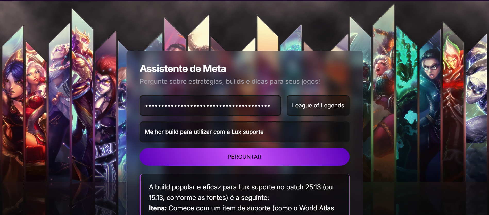

# 🧠 Meta Assistant - Assistente de IA para RPGs

Este é um projeto web que apresenta um assistente de IA especializado em **Meta para jogos RPG competitivos**, como **League of Legends**, **Genshin Impact** e **Valorant**. Criado com **HTML**, **CSS** e **JavaScript**, e integrando a inteligência artificial **Gemini**, o objetivo do assistente é oferecer **dicas estratégicas** e **orientações personalizadas** para jogadores.

---

## 🚀 Sobre o Projeto

Este projeto foi desenvolvido como minha **primeira experiência prática com Inteligência Artificial**, durante um evento promovido pela [Rocketseat](https://www.rocketseat.com.br/). O foco do evento foi explorar novas tecnologias e incentivar a criação de soluções que utilizem IA de forma prática e acessível. 

O aprendizado envolveu:
- Construção de interfaces com HTML e CSS
- Manipulação de dados com JavaScript
- Integração de modelos de IA com Gemini
- Uso de boas práticas de layout e usabilidade
- Uso de uma chave de API do Gemini

---

## 💡 Funcionalidades
- 🔍 Sugestões de builds e táticas otimizadas para o meta atual de cada jogo
- 🎮 Interface limpa e focada na usabilidade
- 💬 Respostas inteligentes fornecidas pela IA Gemini

---

## 🛠 Tecnologias Utilizadas
- HTML5
- CSS3
- JavaScript (Vanilla)
- Gemini (IA)

---

## 🌐 Acesse online

Você também pode testar o assistente diretamente no link:

[https://ai-assistant-games.netlify.app/](https://ai-assistant-games.netlify.app/)

---

